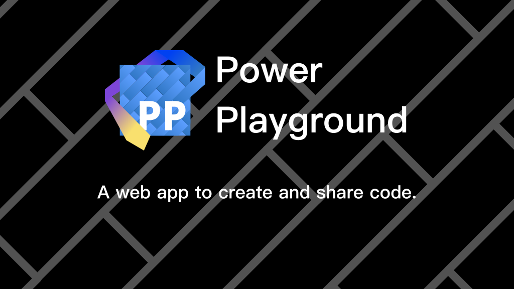

  

# Power Playground

|[zh-Hans](./resources/README.zh-Hans.md)
|en-US

Provide a powerful and scalable API to simplify the cost of building an excellent playground for your project.

* The configuration is simple, diverse, and detailed, catering to your customization needs from various perspectives.
* Supports multiple languages, such as JavaScript, TypeScript, TSX, ...
* Rich plugins with strong extensibility, allowing various functionalities through an extensive API.
* Built on a powerful underlying technology stack, implemented based on Monaco Editor and Chrome DevTools, supporting various editing and running requirements.

## Thanks

Thanks to [🔩 Losses](https://github.com/losses) for the icon design.
I made some modifications based on his design, so if anyone finds it ugly, it's definitely my fault, not his.
